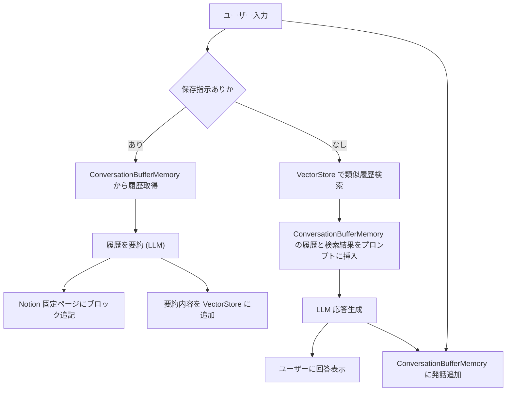

# LangChain_Notion_Agent

## 概要
LLMとの議論中に気に入った小話を、任意のタイミングでNotionに書き込むワークフローを構築する。



## 設定
1. 仮想環境を構築する
```bash
python -m venv venv
```
2. 仮想環境を有効にする
```bash
# Windows
venv\Scripts\activate

# macOS/Linux
source venv/bin/activate
```
3. 必要なパッケージをインストールする
```bash
pip install -r requirements.txt
```
4. 「.env」ファイルを作成し、その中にLLMのAPIキーとNotionのトークンを設定する。

例：
```
OPENAI_API_KEY = "your_openai_api_key"
OPENAI_ORGANIZATION_ID = "your_openai_org_id" # organizationで運用する場合
NOTION_TOKEN = "your_notion_token"
PAGE_ID = "your_notion_page_id"
```
