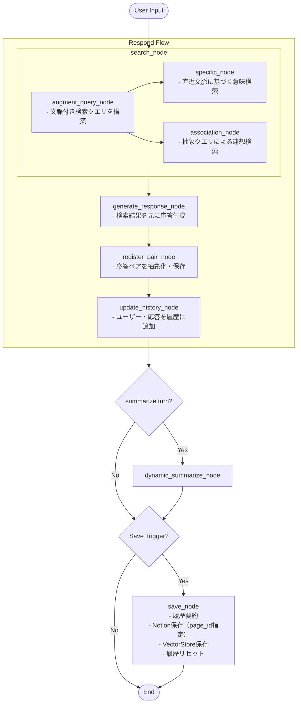

```mermaid
flowchart TD
    Start([User Input]) --> SearchNode

    subgraph Respond Flow

        subgraph SearchNode["search_node"]
            AugmentQueryNode["augment_query_node\n- 文脈付き検索クエリを構築"]
            SpecificNode["specific_node\n- 直近文脈に基づく意味検索"]
            AssociationNode["association_node\n- 抽象クエリによる連想検索"]

            AugmentQueryNode --> SpecificNode
            AugmentQueryNode --> AssociationNode
        end

        SearchNode --> GenerateResponseNode["generate_response_node\n- 検索結果を元に応答生成"]
        GenerateResponseNode --> RegisterPairNode["register_pair_node\n- 応答ペアを抽象化・保存"]
        RegisterPairNode --> UpdateHistoryNode["update_history_node\n- ユーザー・応答を履歴に追加"]
    end

    UpdateHistoryNode --> SummarizeTurn{summarize turn?}
    SummarizeTurn -- Yes --> DynamicSummarizeNode["dynamic_summarize_node"]
    SummarizeTurn -- No --> SaveTrigger{Save Trigger?}
    DynamicSummarizeNode --> SaveTrigger

    SaveTrigger -- Yes --> SaveNode["save_node\n- 履歴要約\n- Notion保存（page_id指定）\n- VectorStore保存\n- 履歴リセット"]
    SaveTrigger -- No --> End([End])
    SaveNode --> End
```
